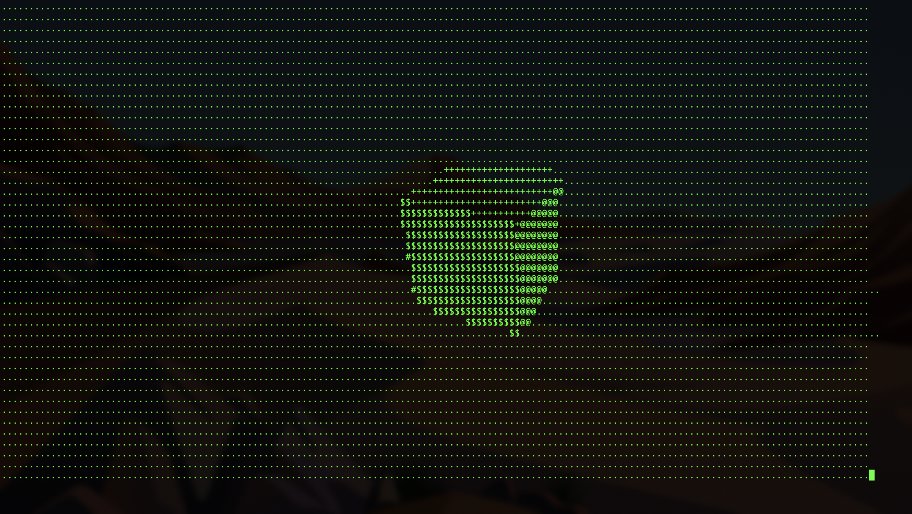

# Cube



## Math
**Rotation Matrix**:
For a 3-dimensional point, we have three angles to consider - $\alpha, \beta, \theta $, which reprent the angles of rotation along the x, y, z axes.

So we have a vector {x, y, z}. To rotate it, we need to mutiply the **3D Rotation Matrix** with it.

1. **$\alpha$ for x axis**

$$
\begin{bmatrix}
1 & 0 & 0 \\
0 & \cos{\alpha} & -\sin{\alpha} \\
0 & \sin{\alpha} & \cos{\alpha} \\
\end{bmatrix}
$$

2. **$\beta$ for y-axis**

$$
\begin{bmatrix}
\cos{\beta} & 0 & \sin{\beta} \\
0 & 1 & 0 \\
-\sin{\beta} & 0 & \cos{\beta} \\
\end{bmatrix}
$$

3. **$\theta$ for z-axis**

$$
\begin{bmatrix}
\cos{\theta} & -\sin{\theta} & 0 \\
\sin{\theta} & \cos{\theta} & 0 \\
0 & 0 & 1 \\
\end{bmatrix}
$$

Note: we can use these 3 matrices to calculate {x', y', z'} after rotation.

## How to contruct 6 surfaces for a cube
We just need to construct the first surface. Then the other 5 surfaces can be easily calculated by rotating the first surface. For example, the second surface are the rotation of 90 degrees of the first surface along the x or y axis.

## How to display the cube on the screen
**Perspective Projection**

1. We can imagine a virtual camera in front of the x-y axis plane, and set **depth = 1 / z, z = z + distanceFromCam** to simulate how we see the cube in the real world.

2. How to map 3-dimensional points to 2-dimensional points:
According to **Perspective Projection**, **x' = x * depth, y' = y * depth**. In the program, we also need to adjust the position and size of the cube:
```
xp := width / 2 + horizontalOffset + K1 * ooz * x * 2
yp := height / 2 + K1 * ooz * y
```
3. When one depth is less that the other depth, the small one can cover the big one.

